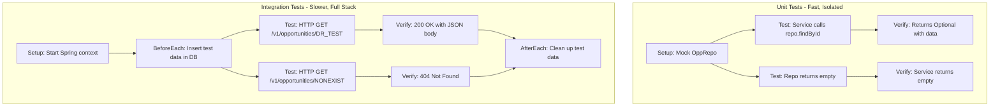

# Add Tests for GET Opportunity API

## Test Strategy

We'll create two types of tests following the existing project patterns:

1. **Unit Tests**: Test `OpportunityServiceImpl` with mocked `OppRepo`
2. **Integration Tests**: Test `OpportunityResource` endpoint with TestRestTemplate

## Files to Create

### 1. OpportunityServiceImplTest.java (Unit Test)

**Path**: `src/test/java/com/adobe/dealtracker/service/impl/OpportunityServiceImplTest.java`

**Test Coverage**:

- Test successful opportunity retrieval by DR number
- Test when opportunity is not found (empty Optional)
- Verify repository is called with correct parameter
- Verify logging behavior

**Test Pattern**: Use Mockito to mock `OppRepo`, inject into `OpportunityServiceImpl`

```java
package com.adobe.dealtracker.service.impl;

import com.adobe.dealtracker.entity.Opportunity;
import com.adobe.dealtracker.repository.OppRepo;
import org.junit.jupiter.api.BeforeEach;
import org.junit.jupiter.api.Test;
import org.junit.jupiter.api.TestInstance;
import org.mockito.InjectMocks;
import org.mockito.Mock;
import org.mockito.MockitoAnnotations;

import java.math.BigDecimal;
import java.time.LocalDate;
import java.time.LocalDateTime;
import java.util.Optional;

import static org.assertj.core.api.Assertions.assertThat;
import static org.mockito.Mockito.verify;
import static org.mockito.Mockito.when;
import static org.mockito.Mockito.times;

@TestInstance(TestInstance.Lifecycle.PER_CLASS)
public class OpportunityServiceImplTest {

    @Mock
    private OppRepo oppRepo;

    @InjectMocks
    private OpportunityServiceImpl opportunityService;

    @BeforeEach
    public void setUp() {
        MockitoAnnotations.openMocks(this);
    }

    @Test
    public void testGetOpportunityByDrNumber_Success() {
        // Arrange
        String drNumber = "DR3951512";
        Opportunity mockOpportunity = createMockOpportunity(drNumber);
        
        when(oppRepo.findById(drNumber)).thenReturn(Optional.of(mockOpportunity));

        // Act
        Optional<Opportunity> result = opportunityService.getOpportunityByDrNumber(drNumber);

        // Assert
        assertThat(result).isPresent();
        assertThat(result.get().getDrNumber()).isEqualTo(drNumber);
        assertThat(result.get().getOpportunityName()).isEqualTo("Enterprise Renewal Deal");
        assertThat(result.get().getSourceSystem()).isEqualTo("D365");
        
        verify(oppRepo, times(1)).findById(drNumber);
    }

    @Test
    public void testGetOpportunityByDrNumber_NotFound() {
        // Arrange
        String drNumber = "NONEXISTENT123";
        
        when(oppRepo.findById(drNumber)).thenReturn(Optional.empty());

        // Act
        Optional<Opportunity> result = opportunityService.getOpportunityByDrNumber(drNumber);

        // Assert
        assertThat(result).isEmpty();
        
        verify(oppRepo, times(1)).findById(drNumber);
    }

    @Test
    public void testGetOpportunityByDrNumber_VerifyRepositoryCall() {
        // Arrange
        String drNumber = "DR1234567";
        
        when(oppRepo.findById(drNumber)).thenReturn(Optional.empty());

        // Act
        opportunityService.getOpportunityByDrNumber(drNumber);

        // Assert - verify repository was called with exact parameter
        verify(oppRepo).findById(drNumber);
    }

    private Opportunity createMockOpportunity(String drNumber) {
        Opportunity opportunity = new Opportunity();
        opportunity.setDrNumber(drNumber);
        opportunity.setOpportunityId("a1b2c3d4-uuid");
        opportunity.setSourceSystem("D365");
        opportunity.setOpportunityName("Enterprise Renewal Deal");
        opportunity.setAccountId("acc-uuid-123");
        opportunity.setSalesStage("4 - Influence");
        opportunity.setLicensingProgram("DX");
        opportunity.setLicensingProgramType("Renewal");
        opportunity.setRouteToMarket("Direct");
        opportunity.setSegment("Enterprise");
        opportunity.setCloseDate(LocalDate.of(2025, 10, 15));
        opportunity.setEstimatedCloseDate(LocalDate.of(2025, 10, 20));
        opportunity.setDealDeskAnalyst("John Doe");
        opportunity.setOmRep("Jane Smith");
        opportunity.setDealDeskComments("Standard renewal process");
        opportunity.setCopsNotes("Customer in good standing");
        opportunity.setPoComments("PO received");
        opportunity.setPaymentTerms("Net 30");
        opportunity.setPaymentTermsStatus("Approved");
        opportunity.setCreditApproval("Approved");
        opportunity.setCreditCheckAmount(new BigDecimal("500000.00"));
        opportunity.setContractStatus("In Progress");
        opportunity.setCreatedOn(LocalDateTime.of(2025, 9, 25, 10, 0));
        opportunity.setCreatedBy("sales@adobe.com");
        opportunity.setModifiedOn(LocalDateTime.of(2025, 10, 1, 7, 33));
        opportunity.setModifiedBy("analyst@adobe.com");
        opportunity.setDeleted(false);
        opportunity.setSyncedAt(LocalDateTime.of(2025, 10, 1, 7, 33));
        
        return opportunity;
    }
}
```

**Key Points**:

- Uses `@Mock` for OppRepo
- Uses `@InjectMocks` for OpportunityServiceImpl
- Tests both success and not-found scenarios
- Verifies repository interactions
- Helper method to create mock opportunity

---

### 2. OpportunityResourceIT.java (Integration Test)

**Path**: `src/test/java/com/adobe/dealtracker/resource/OpportunityResourceIT.java`

**Test Coverage**:

- Test GET endpoint returns 200 for existing opportunity
- Test GET endpoint returns 404 for non-existent opportunity
- Verify response JSON structure matches entity
- Test with different DR number formats
- Verify content-type headers

**Test Pattern**: Use `@SpringBootTest` with `TestRestTemplate` for full end-to-end testing

```java
package com.adobe.dealtracker.resource;

import com.adobe.dealtracker.entity.Opportunity;
import com.adobe.dealtracker.repository.OppRepo;
import org.junit.jupiter.api.AfterEach;
import org.junit.jupiter.api.BeforeEach;
import org.junit.jupiter.api.Test;
import org.junit.jupiter.api.extension.ExtendWith;
import org.springframework.beans.factory.annotation.Autowired;
import org.springframework.boot.test.context.SpringBootTest;
import org.springframework.boot.test.web.client.TestRestTemplate;
import org.springframework.http.HttpStatus;
import org.springframework.http.ResponseEntity;
import org.springframework.test.context.junit.jupiter.SpringExtension;

import java.math.BigDecimal;
import java.time.LocalDate;
import java.time.LocalDateTime;

import static org.assertj.core.api.Assertions.assertThat;

@ExtendWith(SpringExtension.class)
@SpringBootTest(webEnvironment = SpringBootTest.WebEnvironment.RANDOM_PORT)
public class OpportunityResourceIT {

    @Autowired
    private TestRestTemplate restTemplate;

    @Autowired
    private OppRepo oppRepo;

    private static final String TEST_DR_NUMBER = "DR_TEST_001";

    @BeforeEach
    public void setUp() {
        // Create test opportunity in database
        Opportunity testOpportunity = createTestOpportunity(TEST_DR_NUMBER);
        oppRepo.save(testOpportunity);
    }

    @AfterEach
    public void tearDown() {
        // Clean up test data
        oppRepo.deleteById(TEST_DR_NUMBER);
    }

    @Test
    public void testGetOpportunityByDrNumber_Success() {
        // Act
        ResponseEntity<Opportunity> response = restTemplate.getForEntity(
                "/v1/opportunities/" + TEST_DR_NUMBER,
                Opportunity.class
        );

        // Assert
        assertThat(response.getStatusCode()).isEqualTo(HttpStatus.OK);
        assertThat(response.getBody()).isNotNull();
        assertThat(response.getBody().getDrNumber()).isEqualTo(TEST_DR_NUMBER);
        assertThat(response.getBody().getOpportunityName()).isEqualTo("Test Opportunity");
        assertThat(response.getBody().getSourceSystem()).isEqualTo("D365");
        assertThat(response.getBody().getSalesStage()).isEqualTo("4 - Influence");
    }

    @Test
    public void testGetOpportunityByDrNumber_NotFound() {
        // Act
        ResponseEntity<Opportunity> response = restTemplate.getForEntity(
                "/v1/opportunities/NONEXISTENT999",
                Opportunity.class
        );

        // Assert
        assertThat(response.getStatusCode()).isEqualTo(HttpStatus.NOT_FOUND);
        assertThat(response.getBody()).isNull();
    }

    @Test
    public void testGetOpportunityByDrNumber_VerifyAllFields() {
        // Act
        ResponseEntity<Opportunity> response = restTemplate.getForEntity(
                "/v1/opportunities/" + TEST_DR_NUMBER,
                Opportunity.class
        );

        // Assert - Verify all important fields are returned
        assertThat(response.getStatusCode()).isEqualTo(HttpStatus.OK);
        Opportunity opportunity = response.getBody();
        
        assertThat(opportunity).isNotNull();
        assertThat(opportunity.getDrNumber()).isEqualTo(TEST_DR_NUMBER);
        assertThat(opportunity.getOpportunityId()).isEqualTo("test-opp-uuid");
        assertThat(opportunity.getAccountId()).isEqualTo("test-acc-uuid");
        assertThat(opportunity.getLicensingProgram()).isEqualTo("DX");
        assertThat(opportunity.getCloseDate()).isEqualTo(LocalDate.of(2025, 12, 31));
        assertThat(opportunity.getCreditCheckAmount()).isEqualTo(new BigDecimal("100000.00"));
        assertThat(opportunity.isDeleted()).isFalse();
    }

    @Test
    public void testGetOpportunityByDrNumber_ContentType() {
        // Act
        ResponseEntity<Opportunity> response = restTemplate.getForEntity(
                "/v1/opportunities/" + TEST_DR_NUMBER,
                Opportunity.class
        );

        // Assert - Verify content type is JSON
        assertThat(response.getStatusCode()).isEqualTo(HttpStatus.OK);
        assertThat(response.getHeaders().getContentType()).isNotNull();
        assertThat(response.getHeaders().getContentType().toString())
                .contains("application/json");
    }

    private Opportunity createTestOpportunity(String drNumber) {
        Opportunity opportunity = new Opportunity();
        opportunity.setDrNumber(drNumber);
        opportunity.setOpportunityId("test-opp-uuid");
        opportunity.setSourceSystem("D365");
        opportunity.setOpportunityName("Test Opportunity");
        opportunity.setAccountId("test-acc-uuid");
        opportunity.setSalesStage("4 - Influence");
        opportunity.setLicensingProgram("DX");
        opportunity.setLicensingProgramType("New Business");
        opportunity.setRouteToMarket("Direct");
        opportunity.setSegment("Enterprise");
        opportunity.setCloseDate(LocalDate.of(2025, 12, 31));
        opportunity.setEstimatedCloseDate(LocalDate.of(2025, 12, 31));
        opportunity.setDealDeskAnalyst("Test Analyst");
        opportunity.setOmRep("Test OM Rep");
        opportunity.setCreditCheckAmount(new BigDecimal("100000.00"));
        opportunity.setCreatedOn(LocalDateTime.now());
        opportunity.setCreatedBy("test@adobe.com");
        opportunity.setModifiedOn(LocalDateTime.now());
        opportunity.setModifiedBy("test@adobe.com");
        opportunity.setDeleted(false);
        opportunity.setSyncedAt(LocalDateTime.now());
        
        return opportunity;
    }
}
```

**Key Points**:

- Full Spring Boot context with random port
- Uses real database (test profile should use H2 or test DB)
- `@BeforeEach` creates test data, `@AfterEach` cleans up
- Tests actual HTTP requests/responses
- Verifies status codes, headers, and response body

---

## Test Execution Flow



---

## Test Coverage Summary

### Unit Tests (OpportunityServiceImplTest)

- ✅ Success case: Opportunity found
- ✅ Failure case: Opportunity not found
- ✅ Verify correct repository method called
- ✅ Verify correct parameters passed
- ✅ No database dependencies (fast execution)

### Integration Tests (OpportunityResourceIT)

- ✅ HTTP 200 for existing opportunity
- ✅ HTTP 404 for non-existent opportunity
- ✅ Response JSON structure validation
- ✅ All entity fields present in response
- ✅ Content-Type header verification
- ✅ Real database interaction

---

## Running Tests

```bash
# Run all tests
mvn test

# Run only unit tests
mvn test -Dtest=OpportunityServiceImplTest

# Run only integration tests
mvn test -Dtest=OpportunityResourceIT

# Run with coverage
mvn test jacoco:report
```

---

## Test Infrastructure Used

**Dependencies** (already in `pom.xml`):

- `spring-boot-starter-test` includes:
  - JUnit 5 (Jupiter)
  - Mockito
  - AssertJ
  - Hamcrest
  - Spring Test

**Patterns** (matching existing tests):

- Unit tests: Mockito with `@Mock` and `@InjectMocks`
- Integration tests: `@SpringBootTest` with `TestRestTemplate`
- Assertions: AssertJ (`assertThat`)
- Lifecycle: `@BeforeEach` for setup, `@AfterEach` for cleanup

---

## Expected Test Results

After implementation:

- **Unit tests**: ~3 tests, execution time < 1 second
- **Integration tests**: ~4 tests, execution time 5-10 seconds (Spring context startup)
- **Total coverage**: Service layer + REST endpoint fully tested
- **No external dependencies**: Tests can run in CI/CD without real CRM/Kafka

---

## Future Enhancements (Not in this plan)

- Test error handling for database exceptions
- Test with invalid DR number formats
- Performance tests for endpoint response time
- Security tests for authentication/authorization (when implemented)
- Contract tests with Pact (for API consumers)