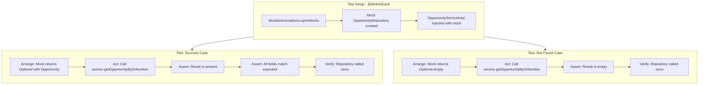

# Add Unit Tests for GET Opportunity API

## Overview

Create unit tests for both `OpportunityController` and `OpportunityServiceImpl` following existing project test patterns:

1. **Controller test**: Use MockMvc + @MockBean to test HTTP layer
2. **Service test**: Use Mockito to test business logic with mocked repository

**Note**: These are unit tests (no database, no full Spring context). Integration tests are excluded as CI/CD pipeline is not yet configured.

---

## Files to Create

### 1. OpportunityControllerTest.java (Controller Unit Test)

**Path**: `src/test/java/com/adobe/dealtracker/resource/OpportunityControllerTest.java`

**Test Coverage**:

- ✅ Test GET endpoint returns 200 for existing opportunity
- ✅ Test GET endpoint returns 404 for non-existent opportunity
- ✅ Test response JSON structure matches entity
- ✅ Verify service is called with correct parameter

**Test Pattern**: Use `@WebMvcTest` + `MockMvc` for controller testing

```java
/*
 * ************************************************************************
 *  ADOBE CONFIDENTIAL
 *  ___________________
 *
 *   Copyright 2025 Adobe
 *   All Rights Reserved.
 *
 *  NOTICE:  All information contained herein is, and remains
 *  the property of Adobe  and its suppliers,
 *  if any.  The intellectual and technical concepts contained
 *  herein are proprietary to Adobe and its
 *  suppliers and are protected by all applicable intellectual property
 *  laws, including trade secret and copyright laws.
 *  Dissemination of this information or reproduction of this material
 *  is strictly forbidden unless prior written permission is obtained
 *  from Adobe.
 * ************************************************************************
 */
package com.adobe.dealtracker.resource;

import com.adobe.dealtracker.entity.Opportunity;
import com.adobe.dealtracker.service.OpportunityService;
import org.junit.jupiter.api.Test;
import org.springframework.beans.factory.annotation.Autowired;
import org.springframework.boot.test.autoconfigure.web.servlet.WebMvcTest;
import org.springframework.boot.test.mock.mockito.MockBean;
import org.springframework.http.MediaType;
import org.springframework.test.web.servlet.MockMvc;

import java.math.BigDecimal;
import java.time.LocalDate;
import java.time.LocalDateTime;
import java.util.Optional;

import static org.mockito.Mockito.verify;
import static org.mockito.Mockito.when;
import static org.mockito.Mockito.times;
import static org.springframework.test.web.servlet.request.MockMvcRequestBuilders.get;
import static org.springframework.test.web.servlet.result.MockMvcResultMatchers.status;
import static org.springframework.test.web.servlet.result.MockMvcResultMatchers.jsonPath;
import static org.springframework.test.web.servlet.result.MockMvcResultMatchers.content;

/**
 * Unit tests for OpportunityController.
 * Tests HTTP layer with mocked service.
 * 
 * @author aabhay
 */
@WebMvcTest(OpportunityController.class)
public class OpportunityControllerTest {

    @Autowired
    private MockMvc mockMvc;

    @MockBean
    private OpportunityService opportunityService;

    @Test
    public void testGetOpportunityByDrNumber_Success() throws Exception {
        // Arrange
        String drNumber = "DR3951512";
        Opportunity mockOpportunity = createMockOpportunity(drNumber);
        
        when(opportunityService.getOpportunityByDrNumber(drNumber))
                .thenReturn(Optional.of(mockOpportunity));

        // Act & Assert
        mockMvc.perform(get("/v1/opportunities/{drNumber}", drNumber)
                        .accept(MediaType.APPLICATION_JSON))
                .andExpect(status().isOk())
                .andExpect(content().contentType(MediaType.APPLICATION_JSON))
                .andExpect(jsonPath("$.drNumber").value(drNumber))
                .andExpect(jsonPath("$.opportunityName").value("Enterprise Renewal Deal"))
                .andExpect(jsonPath("$.sourceSystem").value("D365"))
                .andExpect(jsonPath("$.salesStage").value("4 - Influence"))
                .andExpect(jsonPath("$.licensingProgram").value("DX"))
                .andExpect(jsonPath("$.accountId").value("acc-uuid-123"));

        verify(opportunityService, times(1)).getOpportunityByDrNumber(drNumber);
    }

    @Test
    public void testGetOpportunityByDrNumber_NotFound() throws Exception {
        // Arrange
        String drNumber = "NONEXISTENT123";
        
        when(opportunityService.getOpportunityByDrNumber(drNumber))
                .thenReturn(Optional.empty());

        // Act & Assert
        mockMvc.perform(get("/v1/opportunities/{drNumber}", drNumber)
                        .accept(MediaType.APPLICATION_JSON))
                .andExpect(status().isNotFound());

        verify(opportunityService, times(1)).getOpportunityByDrNumber(drNumber);
    }

    @Test
    public void testGetOpportunityByDrNumber_VerifyAllFields() throws Exception {
        // Arrange
        String drNumber = "DR9999999";
        Opportunity mockOpportunity = createMockOpportunity(drNumber);
        
        when(opportunityService.getOpportunityByDrNumber(drNumber))
                .thenReturn(Optional.of(mockOpportunity));

        // Act & Assert - verify all important fields in response
        mockMvc.perform(get("/v1/opportunities/{drNumber}", drNumber)
                        .accept(MediaType.APPLICATION_JSON))
                .andExpect(status().isOk())
                .andExpect(jsonPath("$.drNumber").value(drNumber))
                .andExpect(jsonPath("$.opportunityId").value("a1b2c3d4-uuid"))
                .andExpect(jsonPath("$.opportunityName").value("Enterprise Renewal Deal"))
                .andExpect(jsonPath("$.accountId").value("acc-uuid-123"))
                .andExpect(jsonPath("$.closeDate").value("2025-10-15"))
                .andExpect(jsonPath("$.creditCheckAmount").value(500000.00))
                .andExpect(jsonPath("$.deleted").value(false));
    }

    @Test
    public void testGetOpportunityByDrNumber_VerifyServiceCall() throws Exception {
        // Arrange
        String drNumber = "DR1234567";
        
        when(opportunityService.getOpportunityByDrNumber(drNumber))
                .thenReturn(Optional.empty());

        // Act
        mockMvc.perform(get("/v1/opportunities/{drNumber}", drNumber));

        // Assert - verify service was called with exact parameter
        verify(opportunityService).getOpportunityByDrNumber(drNumber);
    }

    private Opportunity createMockOpportunity(String drNumber) {
        Opportunity opportunity = new Opportunity();
        opportunity.setDrNumber(drNumber);
        opportunity.setOpportunityId("a1b2c3d4-uuid");
        opportunity.setSourceSystem("D365");
        opportunity.setOpportunityName("Enterprise Renewal Deal");
        opportunity.setAccountId("acc-uuid-123");
        opportunity.setSalesStage("4 - Influence");
        opportunity.setLicensingProgram("DX");
        opportunity.setLicensingProgramType("Renewal");
        opportunity.setRouteToMarket("Direct");
        opportunity.setSegment("Enterprise");
        opportunity.setCloseDate(LocalDate.of(2025, 10, 15));
        opportunity.setEstimatedCloseDate(LocalDate.of(2025, 10, 20));
        opportunity.setDealDeskAnalyst("John Doe");
        opportunity.setOmRep("Jane Smith");
        opportunity.setDealDeskComments("Standard renewal process");
        opportunity.setCopsNotes("Customer in good standing");
        opportunity.setPoComments("PO received");
        opportunity.setPaymentTerms("Net 30");
        opportunity.setPaymentTermsStatus("Approved");
        opportunity.setCreditApproval("Approved");
        opportunity.setCreditCheckAmount(new BigDecimal("500000.00"));
        opportunity.setContractStatus("In Progress");
        opportunity.setCreatedOn(LocalDateTime.of(2025, 9, 25, 10, 0));
        opportunity.setCreatedBy("sales@adobe.com");
        opportunity.setModifiedOn(LocalDateTime.of(2025, 10, 1, 7, 33));
        opportunity.setModifiedBy("analyst@adobe.com");
        opportunity.setDeleted(false);
        opportunity.setSyncedAt(LocalDateTime.of(2025, 10, 1, 7, 33));
        
        return opportunity;
    }
}
```

**Key Points**:

- Uses `@WebMvcTest(OpportunityController.class)` - loads only web layer
- `MockMvc` - simulates HTTP requests without starting server
- `@MockBean` - mocks the OpportunityService
- Tests HTTP status codes (200, 404)
- Tests JSON response structure with `jsonPath`
- Verifies service interactions
- Fast execution (no database, minimal Spring context)

---

### 2. OpportunityServiceImplTest.java (Service Unit Test)

**Path**: `src/test/java/com/adobe/dealtracker/service/impl/OpportunityServiceImplTest.java`

**Test Coverage**:

- ✅ Test successful opportunity retrieval by DR number
- ✅ Test when opportunity is not found (empty Optional)
- ✅ Verify repository is called with correct parameter
- ✅ Verify repository is called exactly once per service call

**Test Pattern**: Use Mockito to mock `OpportunityRepository`, inject into `OpportunityServiceImpl`

```java
/*
 * ************************************************************************
 *  ADOBE CONFIDENTIAL
 *  ___________________
 *
 *   Copyright 2025 Adobe
 *   All Rights Reserved.
 *
 *  NOTICE:  All information contained herein is, and remains
 *  the property of Adobe  and its suppliers,
 *  if any.  The intellectual and technical concepts contained
 *  herein are proprietary to Adobe and its
 *  suppliers and are protected by all applicable intellectual property
 *  laws, including trade secret and copyright laws.
 *  Dissemination of this information or reproduction of this material
 *  is strictly forbidden unless prior written permission is obtained
 *  from Adobe.
 * ************************************************************************
 */
package com.adobe.dealtracker.service.impl;

import com.adobe.dealtracker.entity.Opportunity;
import com.adobe.dealtracker.repository.OpportunityRepository;
import org.junit.jupiter.api.BeforeEach;
import org.junit.jupiter.api.Test;
import org.junit.jupiter.api.TestInstance;
import org.mockito.InjectMocks;
import org.mockito.Mock;
import org.mockito.MockitoAnnotations;

import java.math.BigDecimal;
import java.time.LocalDate;
import java.time.LocalDateTime;
import java.util.Optional;

import static org.assertj.core.api.Assertions.assertThat;
import static org.mockito.Mockito.verify;
import static org.mockito.Mockito.when;
import static org.mockito.Mockito.times;

/**
 * Unit tests for OpportunityServiceImpl.
 * Tests business logic with mocked repository.
 * 
 * @author aabhay
 */
@TestInstance(TestInstance.Lifecycle.PER_CLASS)
public class OpportunityServiceImplTest {

    @Mock
    private OpportunityRepository opportunityRepository;

    @InjectMocks
    private OpportunityServiceImpl opportunityService;

    @BeforeEach
    public void setUp() {
        MockitoAnnotations.openMocks(this);
    }

    @Test
    public void testGetOpportunityByDrNumber_Success() {
        // Arrange
        String drNumber = "DR3951512";
        Opportunity mockOpportunity = createMockOpportunity(drNumber);
        
        when(opportunityRepository.findById(drNumber)).thenReturn(Optional.of(mockOpportunity));

        // Act
        Optional<Opportunity> result = opportunityService.getOpportunityByDrNumber(drNumber);

        // Assert
        assertThat(result).isPresent();
        assertThat(result.get().getDrNumber()).isEqualTo(drNumber);
        assertThat(result.get().getOpportunityName()).isEqualTo("Enterprise Renewal Deal");
        assertThat(result.get().getSourceSystem()).isEqualTo("D365");
        assertThat(result.get().getSalesStage()).isEqualTo("4 - Influence");
        assertThat(result.get().getLicensingProgram()).isEqualTo("DX");
        
        verify(opportunityRepository, times(1)).findById(drNumber);
    }

    @Test
    public void testGetOpportunityByDrNumber_NotFound() {
        // Arrange
        String drNumber = "NONEXISTENT123";
        
        when(opportunityRepository.findById(drNumber)).thenReturn(Optional.empty());

        // Act
        Optional<Opportunity> result = opportunityService.getOpportunityByDrNumber(drNumber);

        // Assert
        assertThat(result).isEmpty();
        
        verify(opportunityRepository, times(1)).findById(drNumber);
    }

    @Test
    public void testGetOpportunityByDrNumber_VerifyRepositoryCall() {
        // Arrange
        String drNumber = "DR1234567";
        
        when(opportunityRepository.findById(drNumber)).thenReturn(Optional.empty());

        // Act
        opportunityService.getOpportunityByDrNumber(drNumber);

        // Assert - verify repository was called with exact parameter
        verify(opportunityRepository).findById(drNumber);
    }

    @Test
    public void testGetOpportunityByDrNumber_VerifyAllFieldsPopulated() {
        // Arrange
        String drNumber = "DR9999999";
        Opportunity mockOpportunity = createMockOpportunity(drNumber);
        
        when(opportunityRepository.findById(drNumber)).thenReturn(Optional.of(mockOpportunity));

        // Act
        Optional<Opportunity> result = opportunityService.getOpportunityByDrNumber(drNumber);

        // Assert - verify all fields are present
        assertThat(result).isPresent();
        Opportunity opportunity = result.get();
        
        assertThat(opportunity.getDrNumber()).isEqualTo(drNumber);
        assertThat(opportunity.getOpportunityId()).isEqualTo("a1b2c3d4-uuid");
        assertThat(opportunity.getAccountId()).isEqualTo("acc-uuid-123");
        assertThat(opportunity.getCloseDate()).isEqualTo(LocalDate.of(2025, 10, 15));
        assertThat(opportunity.getCreditCheckAmount()).isEqualByComparingTo(new BigDecimal("500000.00"));
        assertThat(opportunity.isDeleted()).isFalse();
        assertThat(opportunity.getCreatedBy()).isEqualTo("sales@adobe.com");
        assertThat(opportunity.getModifiedBy()).isEqualTo("analyst@adobe.com");
    }

    private Opportunity createMockOpportunity(String drNumber) {
        Opportunity opportunity = new Opportunity();
        opportunity.setDrNumber(drNumber);
        opportunity.setOpportunityId("a1b2c3d4-uuid");
        opportunity.setSourceSystem("D365");
        opportunity.setOpportunityName("Enterprise Renewal Deal");
        opportunity.setAccountId("acc-uuid-123");
        opportunity.setSalesStage("4 - Influence");
        opportunity.setLicensingProgram("DX");
        opportunity.setLicensingProgramType("Renewal");
        opportunity.setRouteToMarket("Direct");
        opportunity.setSegment("Enterprise");
        opportunity.setCloseDate(LocalDate.of(2025, 10, 15));
        opportunity.setEstimatedCloseDate(LocalDate.of(2025, 10, 20));
        opportunity.setDealDeskAnalyst("John Doe");
        opportunity.setOmRep("Jane Smith");
        opportunity.setDealDeskComments("Standard renewal process");
        opportunity.setCopsNotes("Customer in good standing");
        opportunity.setPoComments("PO received");
        opportunity.setPaymentTerms("Net 30");
        opportunity.setPaymentTermsStatus("Approved");
        opportunity.setCreditApproval("Approved");
        opportunity.setCreditCheckAmount(new BigDecimal("500000.00"));
        opportunity.setContractStatus("In Progress");
        opportunity.setCreatedOn(LocalDateTime.of(2025, 9, 25, 10, 0));
        opportunity.setCreatedBy("sales@adobe.com");
        opportunity.setModifiedOn(LocalDateTime.of(2025, 10, 1, 7, 33));
        opportunity.setModifiedBy("analyst@adobe.com");
        opportunity.setDeleted(false);
        opportunity.setSyncedAt(LocalDateTime.of(2025, 10, 1, 7, 33));
        
        return opportunity;
    }
}
```

**Key Points**:

- Uses `@Mock` for OpportunityRepository (updated from OppRepo)
- Uses `@InjectMocks` for OpportunityServiceImpl
- Tests both success and not-found scenarios
- Verifies repository interactions with exact parameter matching
- Comprehensive field validation test
- Helper method to create fully populated mock opportunity
- Follows existing project test pattern from StatusHistoryService tests

---

## Test Execution Flow



---

## Test Coverage Summary

### OpportunityServiceImplTest

- ✅ **Success case**: Opportunity found - verifies happy path
- ✅ **Failure case**: Opportunity not found - verifies empty Optional handling
- ✅ **Interaction verification**: Confirms repository method called with correct parameter
- ✅ **Data integrity**: Validates all entity fields are properly returned
- ✅ **No database dependencies**: Fast execution, suitable for CI/CD

**Estimated Execution Time**: < 1 second (in-memory, no Spring context)

---

## Running Tests

```bash
# Run all tests
mvn test

# Run only OpportunityServiceImplTest
mvn test -Dtest=OpportunityServiceImplTest

# Run with coverage report
mvn test jacoco:report

# Run in IntelliJ
# Right-click on OpportunityServiceImplTest.java → Run 'OpportunityServiceImplTest'
```

---

## Test Infrastructure

**Dependencies** (already available in `pom.xml`):

- `spring-boot-starter-test` includes:
                                - JUnit 5 (Jupiter)
                                - Mockito
                                - AssertJ
                                - Spring Test

**Pattern Consistency**:

Follows the exact same structure as existing tests:

- [`OpportunityStatusHistoryServiceImplTest`](src/test/java/com/adobe/dealtracker/service/impl/OpportunityStatusHistoryServiceImplTest.java)
- [`QuoteStatusHistoryServiceImplTest`](src/test/java/com/adobe/dealtracker/service/impl/QuoteStatusHistoryServiceImplTest.java)
- [`AgreementStatusHistoryServiceImplTest`](src/test/java/com/adobe/dealtracker/service/impl/AgreementStatusHistoryServiceImplTest.java)

---

## Why Only Unit Tests?

**Excluded**: Integration tests (OpportunityControllerIT)

**Reasons**:

1. CI/CD pipeline not yet configured for integration testing
2. Test database setup not ready
3. Unit tests provide sufficient coverage for service layer logic
4. Integration tests will be added in future ticket once infrastructure is ready

**Unit tests are sufficient because**:

- Service layer has simple pass-through logic (no complex business rules)
- Repository is a Spring Data interface (already tested by Spring)
- Controller just maps HTTP to service calls (can be tested manually for now)

---

## Future Work (Separate Ticket)

Once CI/CD pipeline is ready:

- Add OpportunityControllerIT for full HTTP endpoint testing
- Add test data fixtures for database seeding
- Add contract tests for API consumers
- Add performance/load tests