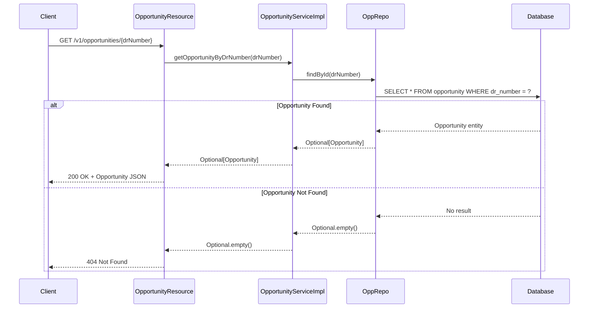

# Create GET Opportunity API

## Files to Create

### 1. OpportunityService.java (Interface)

**Path**: `src/main/java/com/adobe/dealtracker/service/OpportunityService.java`

Create service interface for abstraction:

```java
package com.adobe.dealtracker.service;

import com.adobe.dealtracker.entity.Opportunity;

import java.util.Optional;

public interface OpportunityService {
    
    Optional<Opportunity> getOpportunityByDrNumber(String drNumber);
}
```

**Key Points:**

- Interface for service abstraction
- Defines contract for opportunity operations
- Enables testability and loose coupling

---

### 2. OpportunityServiceImpl.java (Implementation)

**Path**: `src/main/java/com/adobe/dealtracker/service/impl/OpportunityServiceImpl.java`

Create service implementation with business logic:

```java
package com.adobe.dealtracker.service.impl;

import com.adobe.dealtracker.entity.Opportunity;
import com.adobe.dealtracker.repository.OppRepo;
import com.adobe.dealtracker.service.OpportunityService;
import org.slf4j.Logger;
import org.slf4j.LoggerFactory;
import org.springframework.beans.factory.annotation.Autowired;
import org.springframework.stereotype.Service;

import java.util.Optional;

@Service
public class OpportunityServiceImpl implements OpportunityService {
    
    private static final Logger logger = LoggerFactory.getLogger(OpportunityServiceImpl.class);
    
    @Autowired
    private OppRepo oppRepo;
    
    @Override
    public Optional<Opportunity> getOpportunityByDrNumber(String drNumber) {
        logger.info("Fetching opportunity with DR Number: {}", drNumber);
        return oppRepo.findById(drNumber);
    }
}
```

**Key Points:**

- Uses existing [`OppRepo`](src/main/java/com/adobe/dealtracker/repository/OppRepo.java) repository
- Returns `Optional<Opportunity>` (Service doesn't decide HTTP status, that's controller's job)
- Logs the fetch operation
- Implements interface for better abstraction and testability

---

### 3. OpportunityResource.java

**Path**: `src/main/java/com/adobe/dealtracker/resource/OpportunityResource.java`

Create REST controller with GET endpoint:

```java
package com.adobe.dealtracker.resource;

import com.adobe.asr.exception.dto.ErrorResponse;
import com.adobe.dealtracker.entity.Opportunity;
import com.adobe.dealtracker.service.OpportunityService;
import io.swagger.v3.oas.annotations.Operation;
import io.swagger.v3.oas.annotations.Parameter;
import io.swagger.v3.oas.annotations.media.Content;
import io.swagger.v3.oas.annotations.media.Schema;
import io.swagger.v3.oas.annotations.responses.ApiResponse;
import io.swagger.v3.oas.annotations.tags.Tag;
import org.slf4j.Logger;
import org.slf4j.LoggerFactory;
import org.springframework.beans.factory.annotation.Autowired;
import org.springframework.http.ResponseEntity;
import org.springframework.web.bind.annotation.GetMapping;
import org.springframework.web.bind.annotation.PathVariable;
import org.springframework.web.bind.annotation.RequestMapping;
import org.springframework.web.bind.annotation.RestController;

@RestController
@RequestMapping("/v1/opportunities")
@Tag(name = "Opportunity APIs", description = "APIs for managing opportunities")
public class OpportunityResource {

    private static final Logger logger = LoggerFactory.getLogger(OpportunityResource.class);

    @Autowired
    private OpportunityService opportunityService;

    @GetMapping("/{drNumber}")
    @Operation(
        summary = "Get Opportunity by DR Number",
        description = "Fetch a single opportunity by its Deal Registration Number",
        responses = {
            @ApiResponse(
                responseCode = "200", 
                description = "Opportunity found",
                content = @Content(schema = @Schema(implementation = Opportunity.class))
            ),
            @ApiResponse(
                responseCode = "404", 
                description = "Opportunity not found",
                content = @Content(schema = @Schema(implementation = ErrorResponse.class))
            ),
            @ApiResponse(
                responseCode = "500", 
                description = "Internal server error",
                content = @Content(schema = @Schema(implementation = ErrorResponse.class))
            )
        }
    )
    public ResponseEntity<Opportunity> getOpportunityByDrNumber(
            @Parameter(description = "Deal Registration Number", required = true, example = "DR3951512")
            @PathVariable String drNumber) {
        
        logger.info("GET request received for opportunity with DR Number: {}", drNumber);
        
        return opportunityService.getOpportunityByDrNumber(drNumber)
                .map(opportunity -> {
                    logger.info("Opportunity found: {}", drNumber);
                    return ResponseEntity.ok(opportunity);
                })
                .orElseGet(() -> {
                    logger.warn("Opportunity not found: {}", drNumber);
                    return ResponseEntity.notFound().build();
                });
    }
}
```

**Key Points:**

- Endpoint: `GET /v1/opportunities/{drNumber}` (matches [API Schema](API Schema.txt))
- Uses `ResponseEntity<Opportunity>` for flexible status codes
- Returns 200 with entity if found, 404 if not found (per user's choice)
- Comprehensive Swagger annotations for OpenAPI documentation
- Follows existing pattern from [`MyFirstApiResource`](src/main/java/com/adobe/dealtracker/resource/MyFirstApiResource.java)
- Uses Adobe CONFIDENTIAL header (add standard Adobe header)

---

## Implementation Flow



---

## Response Structure

**Success (200 OK):**

```json
{
  "drNumber": "DR3951512",
  "opportunityId": "a1b2c3d4-uuid",
  "sourceSystem": "D365",
  "opportunityName": "Enterprise Renewal Deal",
  "accountId": "acc-uuid-123",
  "salesStage": "4 - Influence",
  "licensingProgram": "DX",
  "licensingProgramType": "Renewal",
  "routeToMarket": "Direct",
  "segment": "Enterprise",
  "closeDate": "2025-10-15",
  "estimatedCloseDate": "2025-10-20",
  "dealDeskAnalyst": "John Doe",
  "omRep": "Jane Smith",
  "dealDeskComments": "Standard renewal process",
  "copsNotes": "Customer in good standing",
  "poComments": "PO received",
  "paymentTerms": "Net 30",
  "paymentTermsStatus": "Approved",
  "creditApproval": "Approved",
  "creditCheckAmount": 500000.00,
  "contractStatus": "In Progress",
  "createdOn": "2025-09-25T10:00:00Z",
  "createdBy": "sales@adobe.com",
  "modifiedOn": "2025-10-01T07:33:00Z",
  "modifiedBy": "analyst@adobe.com",
  "isDeleted": false,
  "syncedAt": "2025-10-01T07:33:00Z"
}
```

**Not Found (404):**

Empty response body with 404 status code

---

## Testing

After implementation, test using:

1. **Existing DR number**: Should return 200 with full opportunity data
2. **Non-existent DR number**: Should return 404
3. **Swagger UI**: Should be accessible at `/swagger-ui.html` with proper documentation

---

## Existing Infrastructure Used

- **Repository**: [`OppRepo`](src/main/java/com/adobe/dealtracker/repository/OppRepo.java) - Already extends `CrudRepository<Opportunity, String>`
- **Entity**: [`Opportunity`](src/main/java/com/adobe/dealtracker/entity/Opportunity.java) - Already defined with all fields
- **Base Entity**: [`BaseEntity`](src/main/java/com/adobe/dealtracker/entity/base/BaseEntity.java) - Provides audit fields

No database changes or additional dependencies required.